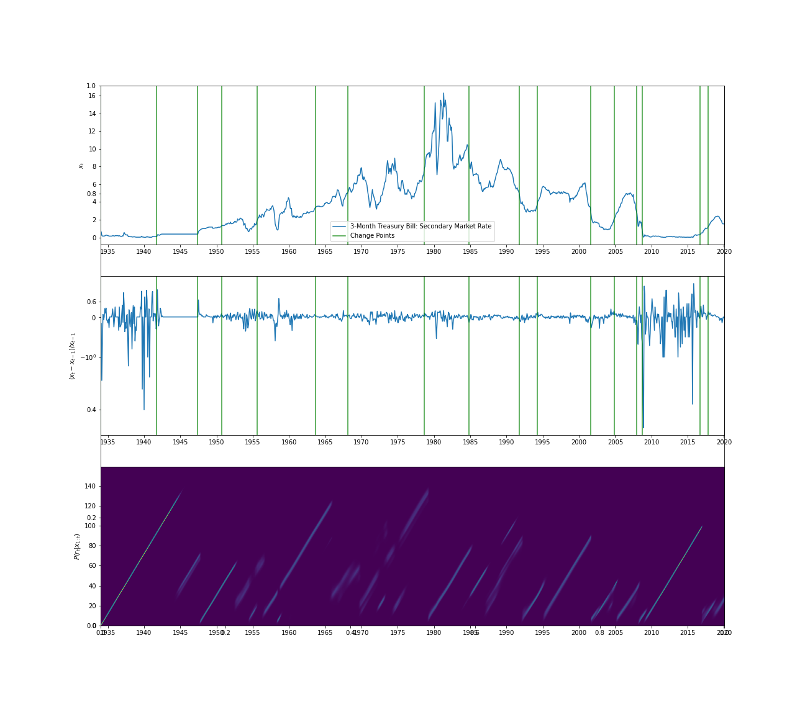

# changepoint - Change point detection for Rust
Changepoint is a library for doing change point detection for streams of data.

[](https://gitlab.com/Redpoll/changepoint/pipelines)
[](https://crates.io/crates/changepoint)
[](https://gitlab.com/Redpoll/changepoint/-/blob/master/LICENSE)
[](https://docs.rs/changepoint)

## Algorithms
Includes the following change point detection algorithms:
* `Bocpd` -- Online Bayesian Change Point Detection [Reference](https://arxiv.org/pdf/0710.3742.pdf).
* `BocpdTruncated` -- Same as `Bocpd` but truncated the run-length distribution when those lengths are unlikely.

## Example
```rust
//! A demo of the online Bayesian change point detection on
//! the 3-month Treasury Bill Secondary Market Rate from
//!
//! After this example is run, the file `trasury_bill.ipynb` can be run to generate
//! plots for this dataset.
//!
//! > Board of Governors of the Federal Reserve System (US), 3-Month Treasury Bill: Secondary
//! > Market Rate [TB3MS], retrieved from FRED, Federal Reserve Bank of St. Louis;
//! > https://fred.stlouisfed.org/series/TB3MS, August 5, 2019.

use changepoint::{utils::*, BocpdTruncated, BocpdLike};
use rv::prelude::*;
use std::io;
use std::path::PathBuf;
use std::fs::read_to_string;

fn main() -> io::Result<()> {
    // Parse the data from the TB3MS dataset
    let mut csv_path = PathBuf::from(env!("CARGO_MANIFEST_DIR"));
    csv_path.push("resources/TB3MS.csv");
    let data: String = read_to_string(&csv_path)?;
    let (dates, pct_change): (Vec<&str>, Vec<f64>) = data
        .lines()
        .skip(1)
        .map(|line| {
            let split: Vec<&str> = line.splitn(2, ',').collect();
            let date = split[0];
            let raw_pct = split[1];
            (date, raw_pct.parse::<f64>().unwrap())
        })
        .unzip();

    // Create the Bocpd processor
    let mut cpd = BocpdTruncated::new(
        250.0,
        NormalGamma::new_unchecked(0.0, 1.0, 1.0, 1.0),
    );

    // Feed data into change point detector and generate a sequence of run-length distributions
    let rs: Vec<Vec<f64>> = pct_change
        .iter()
        .map(|d| cpd.step(d).into())
        .collect();

    // Determine most likely change points
    let change_points: Vec<usize> = map_changepoints(&rs);
    let change_dates: Vec<&str> =
        change_points.iter().map(|&i| dates[i]).collect();

    // Write output for processing my `trasury_bill.ipynb`.
    write_data_and_r(
        "treasury_bill_output",
        &pct_change,
        &rs,
        &change_points,
    )?;

    println!("Most likely dates of changes = {:#?}", change_dates);

    Ok(())
}
```

To run this example, from the source root, run `cargo run --example treasury_bill`.
The partner notebook can be used to generate the following plots:


