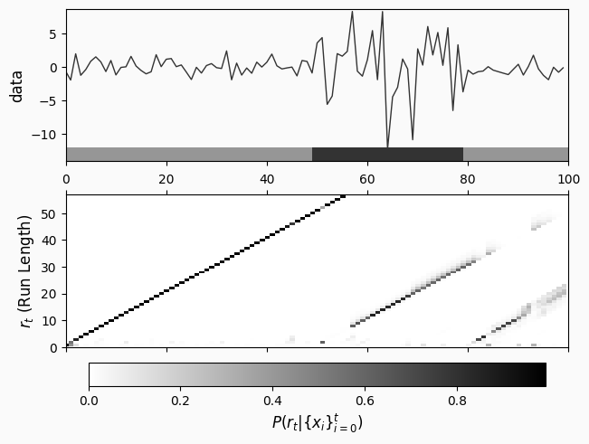

User Tutorial
-------------

Imports as used below.

.. code:: ipython3

    import matplotlib.pylab as plt
    import numpy as np
    import pandas as pd
    from scipy.stats.distributions import norm
    
    import changepoint as chp

Our style, so the plots look as they’re presented here.

.. code:: ipython3

    plt.style.use(
        {
            "lines.linewidth": 1,
            "axes.prop_cycle": "cycler('color', ['333333', '666666'])",
            "figure.facecolor": "#fafafa",
            "axes.facecolor": "#fafafa",
            "image.cmap": "gray_r",
            "legend.fancybox": True,
            "axes.axisbelow": True,
            "axes.grid": False,
            "axes.titlesize": "x-large",
            "axes.labelsize": "large",
            "lines.solid_capstyle": "butt",
        }
    )

``change_point_plot`` is a helper to present plots with helpful
annotations for changepoint analysis.

.. code:: ipython3

    def change_point_plot(data, change_point_history):
        """Plot the data and change point history with Maximum APosterori change-points"""
    
        fig, [data_ax, change_point_ax] = plt.subplots(
            2, 1, sharex=True, constrained_layout=True
        )
    
        data_ax.plot(data)
    
        data_ax.set_ylabel("data")
        change_point_ax.set_ylabel("$r_t$ (Run Length)")
        data_ax.set_xlim(0, len(data))
    
        np.sum(change_point_history, axis=1)
    
        cp_y_upper = np.max(np.argmax(change_point_history, axis=1))
    
        matshow = change_point_ax.matshow(change_point_history.T, origin="lower", aspect="auto")
        change_point_ax.set_ylim(0, cp_y_upper)
        plt.colorbar(matshow, location="bottom", label="$P(r_t | \{x_i\}_{i=0}^t)$")
    
        data_lower, data_upper = 0.975 * np.min(data), 1.05 * np.max(data)
    
        regime_bot, regime_top = data_lower - 0.1 * (data_upper - data_lower), data_lower
        data_ax.set_ylim(regime_bot, data_upper)
    
        map_change_points = np.hstack([chp.map_changepoints(change_point_history), n])
    
        for i, (a, b) in enumerate(zip(map_change_points[:-1], map_change_points[1:])):
            data_ax.fill_between(
                [a, b],
                [regime_bot, regime_bot],
                [regime_top, regime_top],
                color="#333333",
                alpha=0.5 if i % 2 == 0 else 1,
                linewidth=0,
            )
    
        return fig, (data_ax, change_point_ax), map_change_points

A Simple Example
================

The following is a simple example with a distributions shifting time
series.

.. code:: ipython3

    rng = np.random.default_rng(0x123)
    
    dist_a = norm(0, 1)
    dist_b = norm(1, 4)

.. code:: ipython3

    n = 100
    time_series = np.empty(n)
    
    for i in range(n):
        if i >= 50 and i < 80 :
            time_series[i] = dist_b.rvs(random_state=rng)
        else:
            time_series[i] = dist_a.rvs(random_state=rng)

.. code:: ipython3

    plt.plot(time_series)
    plt.title("A Simple Timeseries")
    plt.xlabel("t")
    plt.ylabel("data");
    plt.savefig("simple-timeseries.png", dpi=500)

.. code:: ipython3

    cpd = chp.Bocpd(
        prior=chp.NormalGamma(),
        lam=36,
    )
    change_point_history = np.zeros((n, n))
    for i, x in enumerate(time_series):
        change_point_history[i, : i + 1] = cpd.step(x)

.. code:: ipython3

    change_point_plot(time_series, change_point_history)
    plt.savefig("simple-timeseries-bcpd.png", dpi=500)

The Dataset
===========

Source: https://fred.stlouisfed.org/series/MEDCPIM158SFRBCLE

.. code:: ipython3

    data = pd.read_csv(
        "https://fred.stlouisfed.org/graph/fredgraph.csv?mode=fred&id=CPIAUCSL&fq=Monthly&fam=avg&fgst=lin&fgsnd=2020-02-01&line_index=1&transformation=pc1&vintage_date=2023-01-20&revision_date=2023-01-20&nd=1947-01-01",
        index_col="DATE",
    )

.. code:: ipython3

    data.head()

.. raw:: html

    

    
    <table border="1" class="dataframe">
      <thead>
        <tr style="text-align: right;">
          <th></th>
          <th>CPIAUCSL_PC1</th>
        </tr>
        <tr>
          <th>DATE</th>
          <th></th>
        </tr>
      </thead>
      <tbody>
        <tr>
          <th>1948-01-01</th>
          <td>10.24209</td>
        </tr>
        <tr>
          <th>1948-02-01</th>
          <td>9.48196</td>
        </tr>
        <tr>
          <th>1948-03-01</th>
          <td>6.81818</td>
        </tr>
        <tr>
          <th>1948-04-01</th>
          <td>8.27273</td>
        </tr>
        <tr>
          <th>1948-05-01</th>
          <td>9.38497</td>
        </tr>
      </tbody>
    </table>
    

.. code:: ipython3

    data.index.max()

.. parsed-literal::

    '2023-05-01'

.. code:: ipython3

    data.plot()
    plt.savefig("cpi.png", dpi=500)

.. code:: ipython3

    cpi = data["CPIAUCSL_PC1"]

Standard Bayesian Online Change-point Detection
===============================================

In the standard Bayesian online change-point detection, when a new datum
is observed, the change point detector will create a new summary
statistic, add the new datum to it, and add it to each previous
statistic. This way, the nth statistic only contains information from
the nth datum onward.

Each step, the change point detector returns the probability of
different run-lengths for the current regime. The underlying summary
statistics can tell us how well it describes its currently observed
data, which in the case of a regime change, would may show older data is
described less well than newer data.

In the standard change-point detector, each regime is assumed to be
normally distributed with a Normal-Gamma prior.

.. parsed-literal::

    Init signature: chp.Bocpd(prior, lam)
    Docstring:     
    Online Bayesian Change Point Detection state container
    Create a new BOCPD
    
    Parameters
    ----------
    prior: Prior
        The (conjugate) prior, which also describes the likelihood
        distribution for the stream.
    lam: float
        Expected mean run length. A smaller value means changepoints are
        believed to occur at shorter intervals.
    
    Raises
    ------
    ValueError: lam <= 0.0
    Type:           type
    Subclasses:     

.. code:: ipython3

    cpd = chp.Bocpd(
        prior=chp.NormalGamma(),
        lam=36,
    )
    n = len(cpi)
    change_point_history = np.zeros((n, n))
    for i, x in enumerate(cpi.values):
        change_point_history[i, : i + 1] = cpd.step(x)

.. code:: ipython3

    _, (data_ax, _data_ax), change_points = change_point_plot(cpi, change_point_history)
    
    data_ax.set_xticks([5 * 12 * i for i in range(cpi.shape[0] // (5 * 12))])
    data_ax.set_xticklabels([cpi.index[i][:4] for i in data_ax.get_xticks()])
    data_ax.set_ylabel("Y2Y CPI % Change")
    
    plt.savefig("cpi-bcpd.png", dpi=500)

.. code:: ipython3

    print("\n".join([x[:7] for x in cpi.index[change_points[1:-1]]]))

.. parsed-literal::

    1948-11
    1949-04
    1950-06
    1950-11
    1952-01
    1952-11
    1954-07
    1955-08
    1956-05
    1958-12
    1959-06
    1965-11
    1968-02
    1973-07
    1975-08
    1978-08
    1981-12
    1982-08
    1986-02
    1987-02
    1991-08
    1997-04
    1999-08
    2001-09
    2004-04
    2008-11
    2009-10
    2011-02
    2012-04
    2014-11
    2015-11
    2016-08
    2020-03
    2021-03

Problematic BOCPD
=================

.. code:: ipython3

    n = 1000
    data = np.exp(
        np.sin(2 * np.pi * np.linspace(0, 100, n) / 100)
    ) + 0.1 * np.random.normal(size=n)
    
    cpd = chp.Bocpd(
        prior=chp.NormalGamma(),
        lam=10,
    )
    
    change_point_history = np.zeros((n, n))
    for i, x in enumerate(data):
        change_point_history[i, : i + 1] = cpd.step(x)
    

.. code:: ipython3

    _, _, change_points = change_point_plot(data, change_point_history)
    plt.savefig("smoothly-varying-bcpd.png", dpi=500)

Autoregressive Gaussian Process Change-Point
============================================

.. parsed-literal::

    Init signature:
    chp.ArgpCpd(
        scale=0.5,
        length_scale=10.0,
        noise_level=0.01,
        max_lag=3,
        alpha0=2.0,
        beta0=1.0,
        logistic_hazard_h=Ellipsis,
        logistic_hazard_a=1.0,
        logistic_hazard_b=1.0,
    )
    Docstring:     
    Autoregressive Gaussian Process Change Point detection
    
    Based on Ryan Turner's [thesis](https://www.repository.cam.ac.uk/bitstream/handle/1810/242181/thesis.pdf?sequence=1&isAllowed=y).
    
    Parameters
    ----------
    scale: float
        Scale of the `ConstantKernel`
    length_scale:float
        Length Scale of `RBFKernel`
    noise_level: float
        Noise standard deviation for the `WhiteKernel`
    max_lag: int > 0
        Maximum Autoregressive lag
    alpha0 : float
        Scale Gamma distribution alpha parameter
    beta0: float
        Scale Gamma distribution beta parameter
    logistic_hazard_h: float
        Hazard scale in logit units.
    logistic_hazard_a: float
        Roughly the slope of the logistic hazard function
    logistic_hazard_b: float
        The offset of the logistic hazard function.
    Type:           type
    Subclasses:     

.. code:: ipython3

    n = 1000
    data = np.exp(
        np.sin(2 * np.pi * np.linspace(0, 100, n) / 100)
    ) + 0.1 * np.random.normal(size=n)
    
    argp = chp.ArgpCpd(logistic_hazard_h=-5, scale=1, noise_level=0.1, max_lag=10)
    change_point_history = np.zeros((n + 1, n + 1))
    xs = []
    ys = []
    for i, x in enumerate(data):
        cps = argp.step(x)
        change_point_history[i, : len(cps)] = cps
    
    _, _, change_points = change_point_plot(data, change_point_history)
    plt.savefig("smoothly-varying-argpcp.png", dpi=500)

.. code:: ipython3

    change_points

.. parsed-literal::

    array([   0,    9, 1000])

.. code:: ipython3

    argp = chp.ArgpCpd()
    n = len(time_series)
    change_point_history = np.zeros((n + 1, n + 1))
    xs = []
    ys = []
    for i, x in enumerate(time_series):
        cps = argp.step(x)
        change_point_history[i, : len(cps)] = cps

.. code:: ipython3

    change_point_plot(time_series, change_point_history);
    plt.savefig("simple-timeseries-argpcp.png", dpi=500)

.. code:: ipython3

    argp = chp.ArgpCpd(logistic_hazard_h=-2, scale=3, max_lag=12, noise_level=0.01)
    n = len(cpi)
    change_point_history = np.zeros((n + 1, n + 1))
    xs = []
    ys = []
    for i, x in enumerate(cpi.values):
        cps = argp.step(x)
        change_point_history[i, : len(cps)] = cps

.. code:: ipython3

    _, (data_ax, _data_ax), change_points = change_point_plot(cpi, change_point_history)
    
    data_ax.set_xticks([5 * 12 * i for i in range(cpi.shape[0] // (5 * 12))])
    data_ax.set_xticklabels([cpi.index[i][:4] for i in data_ax.get_xticks()])
    data_ax.set_ylabel("Y2Y CPI % Change")
    plt.savefig("cpi-argp.png", dpi=500)

.. code:: ipython3

    print("\n".join([x[:7] for x in cpi.index[change_points[1:-1]]]))

.. parsed-literal::

    1948-11
    1950-06
    1952-08
    1953-06
    1954-05
    1954-09
    1954-10
    1955-08
    1958-05
    1965-04
    1966-01
    1991-12
    1993-05
    2002-09
    2003-03
    2004-04
    2005-06
    2008-10
    2008-11
    2009-06
    2009-09
    2009-10
    2010-05
    2010-11
    2012-07
    2013-08
    2014-12
    2015-10
    2020-02
    2020-03
    2021-01

.. toctree::
    :maxdepth: 1
    :hidden:
    :titlesonly:

    changepoint <main_namespace>

